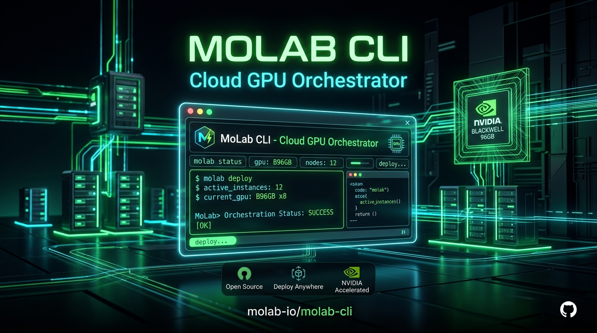

<p align="center">
  
</p>

# MoLab CLI — Autonomous Cloud GPU Orchestrator

<p align="center">
  <strong>High-performance, general-purpose GPU execution platform and AI agent bridge for NVIDIA RTX PRO 6000 Blackwell (96GB VRAM) compute environments on MoLab & CoreWeave.</strong>
</p>

<p align="center">
  <a href="#"></a>
  <a href="#"></a>
  <a href="#"></a>
  <a href="#"></a>
  <a href="#"></a>
  <a href="#"></a>
  <a href="#"></a>
  <a href="#"></a>
  <a href="#"></a>
  <a href="LICENSE"></a>
</p>

---

## 🚀 Overview

`molab-cli` (invoked as `molab` or `molabctl`) transforms ephemeral cloud GPU sandboxes into an industrial-grade compute fabric. Designed from the ground up for developers, researchers, and autonomous AI coding agents, it connects lightweight local environments (like **Termux on Android**, laptops, or remote CI/CD runners) directly to **NVIDIA RTX PRO 6000 Blackwell Server Edition (96GB VRAM)** pods with **zero bytes of local storage used**.

Whether orchestrating 4K neural video enhancement pipelines, hosting 27B+ uncompressed language models, transcribing speech with Whisper, or executing long-running background training jobs, `molab-cli` delivers enterprise reliability through native HTTP/2 streaming, SQLite-backed state tracking, and open standards like the **Model Context Protocol (MCP)**.

---

## 💡 Why This Project Exists

Running high-end GPU workloads in the cloud shouldn't mean juggling fragmented web consoles, manual SSH keys, and fragile browser uploads. Traditional cloud notebook interfaces break down when scripts run long, connections drop, or large datasets are transferred.

`molab-cli` bridges that gap:
- **Zero Terminal Buffer Bottlenecks:** Bypasses kernel PTY 4096-byte WebSocket limitations using direct Marimo HTTP/2 streaming endpoints (`/api/files/create` and `/api/files/download`) at line rate (80+ MB/s).
- **Safe Multi-Pod Coexistence:** Intelligently audits active GPU pods (`molab free`) to prevent accidental disruptions of running production jobs or inference servers.
- **Autonomous Multi-Pod Batch Engine:** Features resource-aware dynamic GPU scheduling, DAG dependency resolution, transactional task leases, and isolated webhook delivery across multi-task pipelines (`molab batch`).
- **Durable Background Job Engine:** Features a local SQLite job repository (`~/.config/molab/jobs.db`) with state machines, exit code traps, live log tailing, and automatic artifact discovery.
- **First-Class AI Agent Interoperability:** Implements an official **MCP Server** (`molab mcp` with 19 typed tools) and a typed Python SDK, empowering AI agents in Claude Desktop, Cursor, and Antigravity to operate cloud GPUs autonomously.

---

## 🎯 Best Use Cases & Workloads

### 1. 🤖 Large AI Model Deployment & OpenAI API Gateway
Deploy heavyweight open-source models (such as `gemma-3-27b-it` or `Qwen-2.5-72B-Instruct`) inside a Blackwell 96GB pod. Expose OpenAI-compatible endpoints directly to `http://localhost:8000/v1` via `molab forward` for local tools like Open WebUI, SillyTavern, or Cursor.

### 2. 🎬 4K Neural Video Enhancement & Media Remastering
Stream multi-gigabyte raw mobile videos straight from device storage to the pod, run PyTorch-accelerated neural upscaling, color grading, and HEVC 60fps encoding, and stream the rendered results directly back without wearing local flash memory.

### 3. 🎙️ High-Speed Speech Recognition & Transcription
Transcribe hours of audio and video in seconds using OpenAI Whisper Large-v3 with batch GPU acceleration via pre-configured workload templates (`molab workload run whisper-transcribe`).

### 4. 🔄 Large Dataset Preparation & Delta Code Sync
Keep local development folders in sync with remote pod environments using SHA-256 manifest delta synchronization (`molab sync`). Only modified or missing files are transferred.

### 5. 🧠 Autonomous Agent Infrastructure & MCP Server
Provide AI agents in Cursor, Claude Desktop, and Antigravity with native capabilities to inspect hardware telemetry, launch jobs, and retrieve output artifacts via `molab mcp`.

---

## 🏛️ System Architecture

```
+-------------------------------------------------------------------------------+
| Client Environment (Termux / Linux / macOS)                                   |
|                                                                               |
|   ~/.config/molab/config.json  <-- Clerk Authentication Session               |
|   ~/.config/molab/jobs.db      <-- Local SQLite Job & Batch Repository        |
|                                                                               |
|   Subsystems:                                                                 |
|   ├── capabilities.py  : Capabilities detection & diagnostic Doctor checks    |
|   ├── execution.py     : Structured execution, exit code traps, nohup launcher|
|   ├── jobs.py          : Persistent SQLite job engine & artifact manifests    |
|   ├── scheduler.py     : Multi-pod resource matcher, DAG solver & orchestrator|
|   ├── notifications.py : Isolated HTTPS/Discord webhooks with secret redaction|
|   ├── mcp.py           : Model Context Protocol (MCP) JSON-RPC 2.0 Server     |
|   ├── transfer.py      : Native HTTP streaming, SHA-256 manifests & sync     |
|   ├── workloads.py     : Pluggable AI workload templates & parameter schemas  |
|   ├── services.py      : Model server lifecycle & application health checks   |
|   └── sdk.py           : High-level typed Python SDK for automated scripts    |
+-------------------------------------------------------------------------------+
         │                                                      │
         │ [HTTPS REST Gateway]                                 │ [WebSocket Gateway]
         │ https://<sb-id>.sb.molab.run                         │ wss://<sb-id>.sb.molab.run/terminal/ws
         │                                                      │
         v                                                      v
+-------------------------------------------------------------------------------+
| Remote Kubernetes Sandbox Pod (Ubuntu 24.04 LTS, root)                        |
|                                                                               |
|   Port 8080: Marimo Server (PID 1)                                            |
|     ├── /api/files/create   : Streaming multipart/form-data upload (80+ MB/s) |
|     ├── /api/files/download : Binary streaming file download                  |
|     ├── /api/status         : Kernel health & version metadata                |
|     └── /terminal/ws        : Interactive PTY root bash shell                 |
|                                                                               |
|   Port 8000: User Model Server (vLLM / SGLang / llama.cpp)                    |
|     └── /v1/chat/completions (OpenAI-compatible REST API)                     |
|                                                                               |
|   Hardware Specifications:                                                    |
|     NVIDIA RTX PRO 6000 Blackwell Server Edition (94.97 GB GDDR7, sm_120)     |
|     188 Streaming Multiprocessors | 160 GiB Host RAM | 20 vCPUs               |
+-------------------------------------------------------------------------------+
```

---

## 🛠️ Installation & Setup

### 1. Installation
Clone and install `molab-cli` in editable mode:

```bash
# Clone the repository
git clone https://github.com/The-habib/molab-cli.git ~/molab-cli
cd ~/molab-cli

# Install package globally
pip install -e .
```

Both `molab` and `molabctl` are now globally accessible.

### 2. Authentication
Authenticate your MoLab account with your Clerk master session:

```bash
# Interactive guided onboarding wizard:
molab login

# Or pass your __client cookie directly:
molab login --client "<__client cookie string>"
```

Verify your setup with the diagnostic doctor:

```bash
molab doctor
```

---

## 🚀 Quick Start (Interactive TUI)

Run `molab` without arguments to launch the **Zero-Typing Interactive Control Center**:

```bash
molab
```

```
╭──────────────────────────────────────────────────────────────────────────────╮
│                                                                              │
│   ███╗   ███╗ ██████╗ ██╗      █████╗ ██████╗                                │
│   ████╗ ████║██╔═══██╗██║     ██╔══██╗██╔══██╗                               │
│   ██╔████╔██║██║   ██║██║     ███████║██████╔╝                               │
│   ██║╚██╔╝██║██║   ██║██║     ██╔══██║██╔══██╗                               │
│   ██║ ╚═╝ ██║╚██████╔╝███████╗██║  ██║██████╔╝                               │
│   ╚═╝     ╚═╝ ╚═════╝ ╚══════╝╚═╝  ╚═╝╚═════╝                                │
│                                                                              │
│     ⚡ Cloud Notebooks & NVIDIA Blackwell Server Hub  •  v2.1.0              │
╰──────────────────────────────────────────────────────────────────────────────╯
╭──────────────────────────────────────────────────────────────────────────────╮
│ ● user@example.com      ⚡ 1 Pod Running (Blackwell 96GB)  NVIDIA RTX PRO 6000│
╰──────────────────────────────────────────────────────────────────────────────╯

? Select an action:
  ❯ 📋 Browse & Manage Notebooks
    🚀 1-Click Launch Blackwell Pod
    🔍 Find Idle / Free GPU Pod
    💻 Open Cloud Root Terminal (Shell)
    🤖 AI Model Studio (Gemma 3 27B)
    ⚡ Real-time GPU Telemetry
    📂 Cloud File Transfer (Push / Pull)
    📦 Python Package Manager
    🔑 Account & Authentication
    ❓ Quick Guide & Documentation
    🚪 Exit
```

---

## 📖 Command Line Reference

Every inspection command supports `-j, --json` for programmatic integration:

### 1. System Diagnostics & Capabilities
```bash
molab doctor                            # Run comprehensive diagnostic health check
molab doctor --json                     # Output diagnostic results as JSON
molab capabilities                      # Discover confirmed platform & compute facts
molab capabilities --json               # Machine-readable capabilities inventory
```

### 2. Smart Discovery & Pod Management
```bash
molab free                              # Audit running pods & identify idle Blackwell GPU
molab free --json                       # Machine-readable workload audit
molab list                              # List all cloud notebooks
molab list --json                       # JSON array of notebooks
molab ps                                # List active CoreWeave sandbox pods
molab create --title "Inference-Pod"   # 1-click launch 96GB Blackwell sandbox
molab compute <id> --blackwell          # Attach NVIDIA Blackwell GPU
molab inspect <id> --json               # Detailed pod hardware metadata
molab stop <id>                         # Stop pod to conserve compute credits
```

### 3. High-Speed File Transfer & Directory Sync
```bash
# Upload a file via native Marimo HTTP multipart streaming:
molab push <id> ./video.mp4 /workspace/input.mp4

# Upload a whole directory recursively:
molab push <id> ./project /workspace/project -r

# Download a processed output:
molab pull <id> /workspace/enhanced.mp4 ./enhanced.mp4

# Delta synchronize directory with SHA-256 manifests (transfers modified files only):
molab sync <id> ./src /workspace/src
molab sync <id> ./src /workspace/src --dry-run --json
```

### 4. Universal Background Jobs & Artifacts
```bash
# Submit detached background job tracked in local SQLite:
molab job submit <id> "python3 train.py --epochs 10" --name "lora-run-1" --json

# List active and historic jobs:
molab job list --json

# Check refreshed status (synchronizes process state, captures exit codes):
molab job status <job_id> --json

# View live trailing execution logs:
molab job logs <job_id> --tail 50

# Cancel a running background job:
molab job cancel <job_id>

# Download output artifacts produced by the job:
molab job artifacts <job_id> --download ./results
```

### 5. Autonomous Multi-Pod Batch Pipelines (v2.2)
```bash
# Validate manifest schema and DAG dependencies:
molab batch validate examples/pipeline_manifest.json

# Submit batch to SQLite queue:
molab batch submit examples/pipeline_manifest.json --max-parallel 2

# Execute pipeline with autonomous pod matching & live progress:
molab batch run examples/pipeline_manifest.json --poll 2.0

# Inspect batch status & task breakdown:
molab batch status <batch_id> --json

# View live execution logs for a task:
molab batch logs <batch_id> --task gpu_verify

# Test isolated webhook notifications:
molab notify test --url https://discord.com/api/webhooks/...
```

### 6. AI Model Studio & Localhost Bridge
```bash
# Check application-level health of model server on pod:
molab serve status <id> --port 8000 --json

# Bridge cloud model server to localhost:8000 for Open WebUI / SillyTavern:
molab forward <id> --port 8000

# Interactive terminal chat with deployed 27B unrestricted model:
molab chat <id>
```

---

## 🤖 Model Context Protocol (MCP) Integration

`molab-cli` includes a built-in JSON-RPC 2.0 Model Context Protocol (MCP) server. To connect **Claude Desktop**, **Cursor**, or **Antigravity**, add this configuration to your client's settings:

```json
{
  "mcpServers": {
    "molab": {
      "command": "molab",
      "args": ["mcp"]
    }
  }
}
```

### Exposed MCP Tools (19 Typed Tools):
- **`molab_doctor`**: Diagnose environment health and connectivity.
- **`molab_capabilities`**: Discover supported hardware, storage, and runtimes.
- **`molab_list_pods`**: List all notebooks and active sandboxes.
- **`molab_get_free_pod`**: Discover idle 96GB Blackwell GPU pods without interrupting jobs.
- **`molab_gpu_telemetry`**: Query real-time Blackwell VRAM, temperature, and CUDA specs.
- **`molab_execute`**: Run structured commands with working directory and exit code trapping.
- **`molab_push_file`**: Upload files or folders via native HTTP/2 streaming.
- **`molab_pull_file`**: Download files or folders via native HTTP/2 streaming.
- **`molab_sync_directory`**: Delta synchronize directory with SHA-256 manifests.
- **`molab_job_submit`**: Submit detached jobs with persistent SQLite tracking.
- **`molab_job_status`**: Poll job status, exit codes, and runtime.
- **`molab_job_logs`**: Retrieve trailing execution logs.
- **`molab_job_cancel`**: Cancel running jobs.
- **`molab_service_status`**: Verify application health of model endpoints.
- **`molab_run_workload`**: Launch pre-configured workload templates.
- **`molab_batch_validate`**: Validate batch pipeline JSON manifests.
- **`molab_batch_submit`**: Submit multi-task pipeline for execution.
- **`molab_batch_status`**: Inspect batch progress and task status.
- **`molab_batch_cancel`**: Cancel running batch pipeline.

---

## 🐍 High-Level Python SDK

Automate MoLab directly within Python scripts using the typed SDK:

```python
from molab_cli.sdk import MoLabSDK

sdk = MoLabSDK()

# 1. Run diagnostic health checks
report = sdk.doctor()
print("System Health:", report["status"])

# 2. Acquire an idle 96GB Blackwell GPU pod
pod = sdk.get_free_pod()
if not pod:
    raise RuntimeError("No idle Blackwell pod available")

# 3. Delta synchronize project directory
pod.sync("./my_project", "/workspace/my_project")

# 4. Submit an asynchronous background job
job = pod.submit_job(
    command="python3 /workspace/my_project/train.py --batch-size 32",
    name="finetune-run-1",
    workdir="/workspace/my_project"
)
print(f"Submitted Job ID: {job['id']}")

# 5. Refresh status and download artifacts
status = sdk.get_job(job["id"])
if status["status"] == "COMPLETED":
    sdk.job_manager.download_artifacts(job["id"], "./results")
```

---

## 🔬 Hardware Specifications

| Metric | CoreWeave Cloud Container Spec |
|---|---|
| **GPU Model** | **NVIDIA RTX PRO 6000 Blackwell Server Edition** |
| **VRAM** | **94.97 GB GDDR7** (97,251 MB) |
| **Compute Capability** | `sm_120` (Architecture: Blackwell, Major: 12, Minor: 0) |
| **Multiprocessors** | 188 Streaming Multiprocessors (SMs) |
| **Host System RAM** | 160.0 GiB RAM |
| **Host CPU Cores** | 20 vCPUs (x86_64) |
| **CUDA & PyTorch** | CUDA 13.0 / 13.2 + PyTorch 2.11.0 |
| **Local Phone Storage** | **0 Bytes Used** (Zero storage footprint on client) |

---

## 📚 Complete Documentation Suite

- 🏛️ **[Technical Architecture & Protocols](docs/ARCHITECTURE.md)**: Deep dive into network gateways, Clerk auto-minting, and SQLite job persistence.
- 📖 **[Command-Line Reference](docs/CLI_REFERENCE.md)**: Syntax, options, and JSON examples for all commands.
- 🤖 **[Autonomous Agent Guide](docs/AGENT_GUIDE.md)**: Best practices, safety rules, and Python SDK recipes for AI coding agents.
- 🍳 **[Workload Recipes](docs/RECIPES.md)**: Step-by-step guides for 4K video neural enhancement, vLLM serving, and LoRA training.
- 🔧 **[Troubleshooting Runbook](docs/TROUBLESHOOTING.md)**: Diagnosing Clerk 401s, WebSocket disconnects, and OOM exceptions.

---

## 📄 License

MIT License. Copyright (c) 2026 TG Habib.
