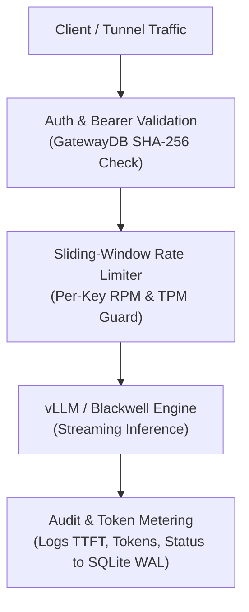

# MoLab AI Gateway Control Plane & Key Governance Manual

This manual provides documentation for the MoLab AI Gateway control plane, SQLite WAL multi-tenant persistence layer, sliding-window rate limiting engine, audit logging, and Prometheus scraping infrastructure.

---

## 1. Gateway Architecture Overview

The MoLab AI Gateway acts as an enterprise control plane interposed between external clients (or public tunnels) and the low-level vLLM inference backend on the Blackwell GPU pod.



### Core Responsibilities:
1. **Virtual Key Governance:** Isolates client access using virtual tokens (`sk-molab-...`).
2. **Quota & Rate Enforcement:** Protects GPU compute from denial-of-service via granular RPM and TPM limits.
3. **Observability & Auditing:** Atomically logs per-request metrics (prompt tokens, completion tokens, time-to-first-token, duration, HTTP status code).
4. **Zero-Overhead Local Storage:** Uses high-concurrency SQLite with Write-Ahead Logging (WAL) enabled (`~/.config/molab/gateway.db`).

---

## 2. Virtual Key Governance

### Key Schema:
* **Storage Location:** `~/.config/molab/gateway.db`
* **Security Model:** Raw secret keys are displayed **once** upon creation. The database stores only the SHA-256 hash (`hashed_key`) and an identification prefix (`sk-molab-32c48...`).

### CLI Key Management:
```bash
# 1. Create a key with 60 requests/min and 60,000 tokens/min:
molab keys create "production-agent" --rpm 60 --tpm 60000

# 2. List all registered keys and lifetime token consumption:
molab keys list

# 3. Deactivate or revoke a compromised key:
molab keys revoke key_bec3175bba79
```

---

## 3. Sliding-Window Rate Limiting Engine

The rate limiter tracks token consumption and request velocity across a 60-second sliding window with microsecond timestamp precision.

### Dual-Constraint Evaluation:
For each incoming request:
1. **Requests Per Minute (RPM):**
   $$\text{Active Requests in Window} < \text{rpm\_limit}$$
2. **Tokens Per Minute (TPM):**
   $$\text{Tokens in Window} + \text{Estimated Prompt Tokens} < \text{tpm\_limit}$$

### RFC 6585 Standard Headers:
Every API response (both success and rate-limited) returns standard rate-limit headers:
```http
x-ratelimit-limit-requests: 60
x-ratelimit-remaining-requests: 58
x-ratelimit-limit-tokens: 60000
x-ratelimit-remaining-tokens: 58240
```
When limits are breached, the Gateway returns **HTTP 429 Too Many Requests**:
```json
{
  "error": {
    "message": "Rate limit exceeded: 60 requests/min limit reached. Retry in 14s.",
    "type": "rate_limit_error",
    "code": 429
  }
}
```

---

## 4. Observability & Telemetry Endpoints

### 1. Prometheus Scrape Endpoint (`/metrics`)
Standard OpenMetrics format ready for scraping by Prometheus, Grafana Agent, or Datadog:
```bash
curl http://127.0.0.1:8000/metrics
```
**Sample Output:**
```text
# HELP molab_gateway_requests_total Total API requests processed by gateway
# TYPE molab_gateway_requests_total counter
molab_gateway_requests_total 42
# HELP molab_gateway_prompt_tokens_total Total prompt tokens processed
# TYPE molab_gateway_prompt_tokens_total counter
molab_gateway_prompt_tokens_total 12840
# HELP molab_gateway_completion_tokens_total Total completion tokens generated
# TYPE molab_gateway_completion_tokens_total counter
molab_gateway_completion_tokens_total 4120
# HELP molab_gateway_avg_latency_ms Average request latency in milliseconds
# TYPE molab_gateway_avg_latency_ms gauge
molab_gateway_avg_latency_ms 384.2
# HELP molab_gateway_avg_ttft_ms Average time to first token in milliseconds
# TYPE molab_gateway_avg_ttft_ms gauge
molab_gateway_avg_ttft_ms 76.4
```

### 2. JSON Stats Endpoint (`/v1/gateway/stats`)
```bash
curl http://127.0.0.1:8000/v1/gateway/stats
```
Returns active key count, lifetime tokens, average TTFT, and the 10 most recent request audit records.
