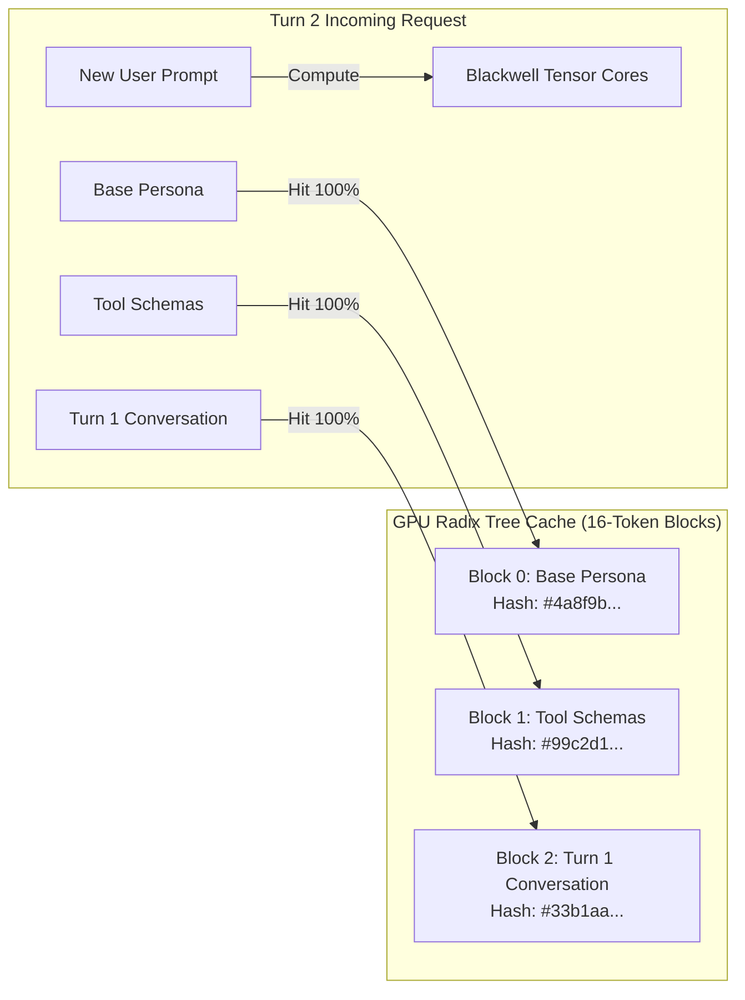

# MoLab Inference Engine Optimization & Kernel-Level Systems Manual

This manual details the low-level systems engineering, GPU memory geometry, kernel compilation strategies, and cache optimization protocols that enable commercial-grade inference speeds on **NVIDIA RTX PRO 6000 Blackwell (96GB GDDR7, sm_120)**.

---

## 1. The Kernel Dispatch Layer: FlashInfer vs FlashAttention

vLLM supports four potential attention dispatch backends:
1. `FLASHINFER`: State-of-the-art customized CUDA/Triton kernels designed specifically for modern Hopper and Blackwell architectures.
2. `FLASH_ATTN`: FlashAttention-2 standard implementation.
3. `TRITON_ATTN`: Dynamic Triton-compiled attention kernels.
4. `FLEX_ATTENTION`: PyTorch 2.5+ flexible attention dispatch.

### Why FlashInfer is the Default for Blackwell:
* **Asymmetric Decode Throughput:** FlashInfer decouples prefill kernels from decode kernels, heavily optimizing the decode step where memory bandwidth limits performance.
* **Page-Table Lookups:** Minimizes memory redirection overhead when reading non-contiguous PagedAttention memory blocks from GDDR7.
* **Environment Tuning:**
  ```bash
  export VLLM_ATTENTION_BACKEND=FLASHINFER
  export VLLM_USE_FLASHINFER_AUTOTUNE=1
  ```

---

## 2. Automatic Prefix Caching (APC) Mechanics

Automatic Prefix Caching is the primary performance multiplier for multi-turn conversational agents, autonomous coding loops (Claude Code, Hermes Agent), and system-prompt heavy workloads.



### The 16-Token Hash Block Rule:
* vLLM organizes KV cache blocks into **16 tokens per block**.
* As tokens arrive, vLLM hashes them sequentially from left to right:
  $$\text{Hash}_n = \text{SHA256}(\text{Hash}_{n-1} + \text{Tokens}_{16n \dots 16n+15})$$
* **The Prefix Invalidation Trap:** If even a single character changes at token 10 (e.g. dynamic timestamp or git branch), **all downstream hashes from token 10 to token 30,000 are invalidated**, forcing full recomputation.

### The Prefix Cache Stability Contract:
To guarantee > 85% cache hit rates in production:
1. **Byte-Freeze the Base Prompt:** The system prompt, role definition, and instructions must remain strictly identical across every turn.
2. **Deterministic Tool Sorting:** Always sort tool JSON schemas alphabetically by name before serialization:
   ```python
   tools_sorted = sorted(tools, key=lambda x: x.get("name", ""))
   ```
3. **Tail-Only Dynamic Context Injection:** Ephemeral variables (git diff status, uncommitted files, current time, dynamic search results) must **never** be placed inside the system prompt. Inject them exclusively at the tail boundary within the current user message.

---

## 3. Chunked Prefill & Dynamic Batching Tuning

### The Problem with Monolithic Prefills:
When an agent submits a 10,000-token prompt (e.g. reading an entire source code file), standard engines pause all ongoing streaming token generation for 1.5–3 seconds to compute the large prefill. This causes "jitter" and pauses in active streaming outputs.

### The Chunked Prefill Solution:
* Chunked prefill splits incoming prompt tokens into discrete slices of size `max_num_batched_tokens` (default: 8,192 on Blackwell).
* It interleaves prompt prefill chunks with active token decode steps in the same forward pass.
* **Tuning Matrix for Blackwell:**
  * Interactive Chat / Code Completion: `--max-num-batched-tokens 8192` (balanced TTFT and silky-smooth decode streaming).
  * High-Concurrency Batch APIs: `--max-num-batched-tokens 16384` (maximizes compute saturation on Blackwell's 600W power envelope).

---

## 4. Blackwell VRAM Memory Budgeting & Geometry

The NVIDIA RTX PRO 6000 Blackwell provides 97,887 MiB (95.59 GB) of usable physical memory.

### Memory Geometry Breakdown (for 32B Model):
$$\text{Total VRAM (95.59 GB)} = \text{Model Weights} + \text{CUDA Runtime / Activations} + \text{KV Cache Pool}$$

1. **Model Weights (Bfloat16):**
   $$32.5 \times 10^9 \text{ parameters} \times 2 \text{ bytes} \approx 61.03 \text{ GiB}$$
2. **CUDA Context & Activation Buffers:**
   $$\approx 4.5 \text{ GiB}$$
3. **Dedicated Dynamic KV Cache Pool:**
   $$95.59 \text{ GB} - 61.03 \text{ GB} - 4.5 \text{ GB} \approx 30.06 \text{ GB}$$

### Dynamic KV Cache Capacity:
With 30 GB allocated to KV cache:
* At Bfloat16 KV Cache: Stores **~120,000 tokens** concurrently (supports two full 64K conversations or ten 12K conversations).
* At FP8 / NVFP4 KV Cache: Stores **~240,000–480,000 tokens** concurrently!

---

## 5. CUDA Graph Capture vs Eager Mode

* **Eager Mode (`--enforce-eager`):**
  * Launches individual CUDA kernels from Python for every layer and attention operation.
  * Introduces CPU-GPU synchronization latency of 5–15 $\mu s$ per kernel call.
  * Over 64 layers, this adds 1–2 ms of pure overhead per generated token.
* **CUDA Graph Capture (Default in vLLM V1):**
  * Records the entire forward pass execution graph into GPU memory during startup warmup.
  * Replays the entire model pass with a single hardware doorbell trigger.
  * Maximizes decode throughput (55–70+ tokens/sec on Blackwell).
